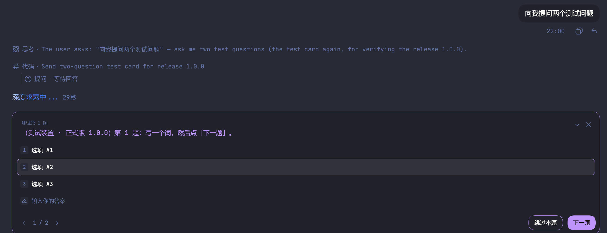
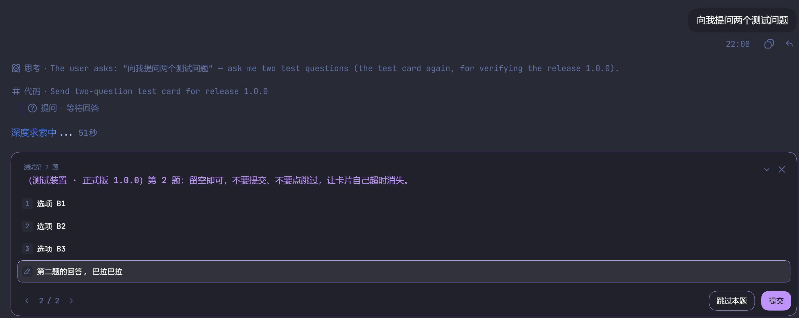
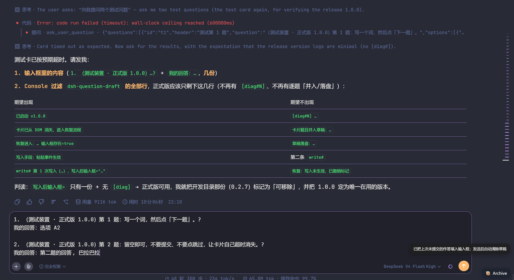

# DSH 提问草稿保全 · Chrome 浏览器扩展

> 你有没有过这种情况：花半天答完 DSH 的一整组提问，结果提问弹窗因为超时或误关消失了，已经选好的选项、写好的回答**全部丢失**，只能从头再答一遍？

这是一个 **Chrome 浏览器扩展**（Manifest V3），**不是 DSH 插件**：它装在浏览器里，以内容脚本的方式作用在 DSH 页面上，不需要改 DSH 一行代码、不需要重启 DSH，也不与服务端交互。

装上之后，你在提问卡片里选中的选项和输入的文字会被实时存到本机；卡片一旦超时或被关掉，扩展会**自动**把未提交的作答整理成一段文本写进聊天输入框 —— 不用点任何按钮，也不用重新打开卡片，检查无误后回车发出即可。

- 卡片消失后的回填是**全自动**的，无需任何操作
- 浏览器扩展：塞进 Chrome / Edge 即可用，无构建步骤，纯 JS 内容脚本（Manifest V3）
- 不联网、不收集、不外传任何数据
- 站点范围仅限本机 DSH 与你自建的 DSH 域名

> **English** — A **Chrome (Manifest V3) browser extension, not a DSH plugin**: install it in Chrome and it saves your in-progress answers to DSH question cards into `chrome.storage.local`; when the card times out or is dismissed it **automatically** writes the unsubmitted answers back into the chat composer, with no clicking required. No build step, no change on the DSH side, no network requests, no telemetry.

## 效果

**1. 作答中：选项与手写文字都被实时记录**



**2. 卡片即将超时：即使暂未提交，草稿也已落盘**



**3. 卡片消失后：作答被整理成「问题 + 我的回答」回填输入框**



## 功能

| 场景 | 行为 |
| --- | --- |
| 卡片在屏幕上 | 每 500ms（防抖）保存一次草稿，按标签页隔离，键名前缀 `qd:` |
| 卡片超时 / 被顶掉消失 | **全自动**：宽限 2 秒后扩展自己进入恢复流程，把未提交的题与答案写进输入框，无需任何操作 |
| 点「下一题 / 上一题」 | 只翻页，**不清草稿**，并把已答题并入草稿 |
| 点「提交 / 跳过本题」 | 清除本对话草稿 |
| 填入的内容被发送（输入框清空） | 清除本对话草稿 |
| 输入框里已有你自己打的字 | 不覆盖，只在右下角浮一条提示，可点击插入 |
| 草稿超过 24 小时 | 启动时自动清理 |

写入输入框采用「一次只试一种手段、写完校验、没进去才试下一种」（粘贴事件 → execCommand → 直接赋值），避免重复插入，也避免插入失败后残留「已插入」标记。

## 安装

这是装在浏览器里的扩展，**DSH 侧不需要安装或配置任何东西**。从 [Releases](https://github.com/brestain/dsh-question-draft/releases/latest) 下载 `dsh-question-draft-1.0.0.zip`：

1. 解压到一个**固定目录**（Chrome 记住的是文件夹路径，之后不要删除或移动）
2. 打开 `chrome://extensions`，右上角打开「开发者模式」
3. 点「加载已解压的扩展程序」，选择解压出来的文件夹
4. 刷新 DSH 页面（内容脚本只在页面加载时注入）

开发调试也可以直接克隆本仓库，加载仓库根目录。

## 使用

1. 照常在提问卡片里勾选选项 / 输入文字
2. 卡片超时或被关掉后，扩展自动把作答写进输入框（不需要你点任何东西）：

```text
1. （问题原文）？
我的回答：选项 A2

2. （问题原文）？
我的回答：第二题的回答，巴拉巴拉
```

3. 检查无误后回车发出，草稿自动清除；若输入框里已有你自己的内容，右下角的小条点一下才会插入

## 排错

在 DSH 页面打开 DevTools Console，过滤 `dsh-question-draft`，正常只会看到几条关键日志（启动 / 卡片消失 / 恢复 / 写入 / 失败）。

逐题落盘与心跳诊断日志默认关闭；需要排查时把 `qd-draft.js` 顶部的 `const DEBUG = false` 改成 `true`，再到 `chrome://extensions` 点一次「重新加载」。

## 权限与隐私

- 这是浏览器扩展，只申请了 `storage`：用于在本机保存草稿（`chrome.storage.local`）
- 站点权限：`127.0.0.1`、`localhost`、`dsh.finalrat.icu`
- 不发起任何网络请求，不含远程代码、统计与广告；详见 [PRIVACY.md](PRIVACY.md)

## 目录结构

```text
manifest.json   扩展清单（Manifest V3）
qd-draft.js     全部逻辑，内容脚本
icons/          图标
docs/           效果截图
PRIVACY.md      隐私说明
LICENSE         MIT
```

## 版本

- **v1.0.0**（2026-09-25）首个正式版：草稿实时落盘、超时自动回填、翻页与提交识别、去重写入、24 小时过期清理

## 许可

[MIT](LICENSE)
